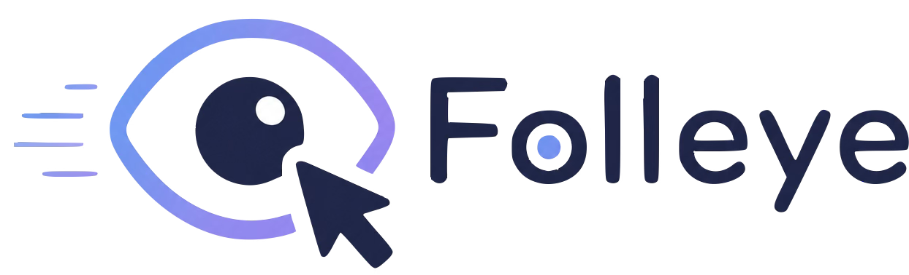

# Folleye

**Folleye** is a macOS menubar app that uses your eye gaze to automatically route scroll input to whichever window you're looking at — no mouse movement required.



---

## Download

**[⬇ Download Folleye.dmg (v1.0.0)](https://github.com/kanryul225/Folleye/releases/latest)**

1. Open the downloaded DMG
2. Drag **Folleye.app** into the Applications folder
3. Launch from Applications — the Folleye icon appears in your menubar

> **First launch — Gatekeeper warning:** Since the app isn't notarized, macOS may block it.
> - **Option 1 (easiest):** Right-click `Folleye.app` → **Open** → click **Open** in the dialog
> - **Option 2:** System Settings → Privacy & Security → scroll down → click **Open Anyway**
>
> You only need to do this once.

---

## How it works

1. **Calibrate** — follow a series of dots on screen with your eyes (~30 seconds). Folleye learns your personal gaze pattern using MediaPipe face blendshapes.
2. **Start Tracking** — Folleye runs quietly in the menubar. Whenever your mouse has been idle for ~1.5 seconds, it moves the cursor to the window you're looking at.
3. **Scroll freely** — look at a window, scroll with your mouse wheel or trackpad, no clicking needed.

Tracking never interrupts normal mouse use — if you move the mouse yourself, Folleye stays out of the way.

---

## Features

- Menubar app — lives in your status bar, no Dock icon
- Gaze-based window focus routing
- One-time calibration per session (saves to `calibration.json`)
- Optional gaze dot overlay (off by default, toggle from menubar)
- Onboarding UI guides you through calibration and first use
- Recalibrate anytime from the menubar

---

## Requirements

- macOS (Apple Silicon)
- Python 3.9+
- A webcam

---

## Setup

```bash
# 1. Clone the repo
git clone https://github.com/kanryul225/Folleye.git
cd Folleye

# 2. Create a virtual environment
python3 -m venv venv
source venv/bin/activate

# 3. Install dependencies
pip install mediapipe==0.10.9 opencv-python numpy pyobjc-framework-Cocoa pyobjc-framework-AVFoundation

# 4. Download the MediaPipe face landmarker model
curl -L -o resources/face_landmarker.task \
  https://storage.googleapis.com/mediapipe-models/face_landmarker/face_landmarker/float16/latest/face_landmarker.task

# 5. Run
python main.py
```

> **Camera & Accessibility permissions** — macOS will prompt for camera access on first run. Accessibility access is required for cursor movement: go to System Settings → Privacy & Security → Accessibility and add your terminal app.

---

## Usage

1. Run `python main.py` — the Folleye icon appears in your menubar.
2. The onboarding window opens automatically. Click **Start Calibration** and follow the dots.
3. After calibration, click **Start Tracking**.
4. Look at any window and scroll — the cursor follows your gaze.

To recalibrate: click the Folleye icon in the menubar → **Calibration**.

---

## Tech stack

| Component | Library |
|---|---|
| Gaze detection | [MediaPipe Face Landmarker](https://ai.google.dev/edge/mediapipe/solutions/vision/face_landmarker) (blendshapes) |
| UI & menubar | AppKit via [pyobjc](https://pyobjc.readthedocs.io/) |
| Window management | Quartz / CoreGraphics |
| Gaze → screen mapping | Least-squares regression (NumPy) |

---

## License

MIT
